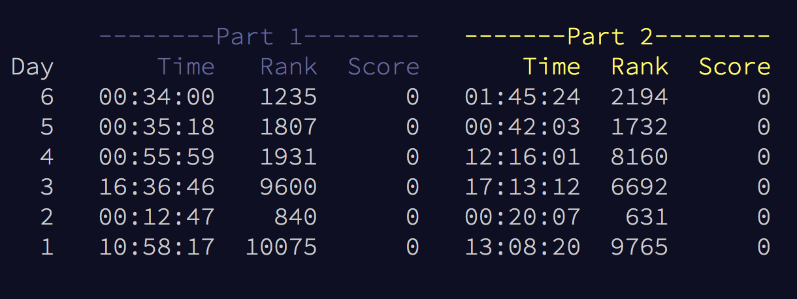

# AdventofCode-2017

## Day 6
I was able to do part 1 in the default Mac project set-up but part 2 lacked the performance (5 mins of runtime wasn't able to compute answer) to generate the answer so I jankily made a solution around the poor performance. 

What I learned:
Atfirst I thought it was because of it being in the Mac setup so I learned how to compile swift files from the terminal ```swiftc -o fibonacci fibonacci.swift``` and along the way I discovered other stuff like ```array.max()!``` to find the max element, ```array.index(where: { $0 == elem})``` to get the index of an elem, and ```array.contains(where: { $0 == elem })``` to find if the array contains the elem. I knew of these type of functions before in Java and Obj-C but this was my first time encountering them in Swift 4.

How I solved my performance issue:
It was taking a long time to compute so I decided to firstly perform the first part of the algorithim with generates and adds lists to a list Array and then after 10,000 additions THEN check if there are 2 lists that are the same instead of doing it for every list addition.

## Day 5
I found the default Mac project set-up faster to compute with than the playground.

## Day 4
Had to write it in python becuase XCode couldn't compile/process such a large input.

## Stats


